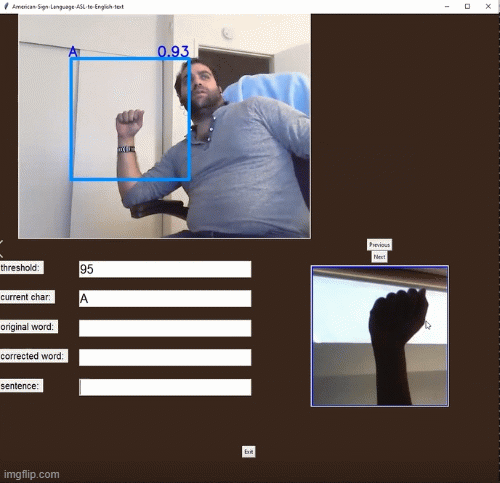
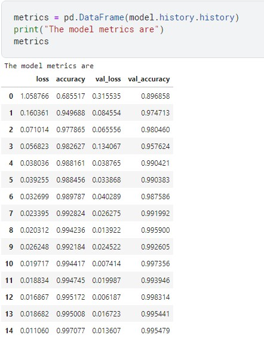
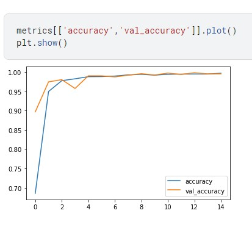
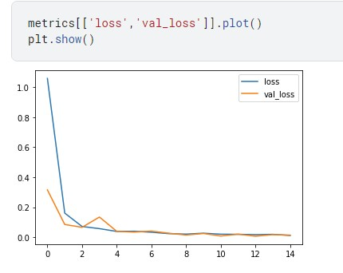

#  <u> American-Sign-Language-ASL-to-English-text  </u> #

## ASL Translator ##

The ASL Translator project is aimed at developing a machine learning-based system that translates American Sign Language (ASL) gestures into English. This project utilizes a dataset found on Kaggle, which provides a collection of ASL alphabet images for training and testing.

---

## Team Member ##
- Sarkis Bouzikian
- Ryan
- Conar

---

## Project Objective ##
The primary objective of this project is to create a runnable program that can accurately interpret ASL signs captured through images, videos, and live feeds in real-time. The program is designed to assist deaf and hard-of-hearing individuals in understanding and communicating in classroom interactions. The traditional approach of relying on human translators to interpret sign language word by word can be challenging, and this project aims to provide an automated solution.

---

## ASL Detection and Translation ## 
ASL detection involves recognizing and understanding the hand gestures and movements that represent individual letters or words in American Sign Language. The project leverages machine learning techniques to train a model that can accurately classify ASL gestures. The model is built using the Keras library and follows a convolutional neural network (CNN) architecture.

The training data consists of images of ASL alphabet gestures, with each image labeled with the corresponding letter. The dataset is split into training and testing sets to evaluate the model's performance. During training, the model learns to recognize patterns and features in the images, allowing it to classify new, unseen gestures.

Once the model is trained, it can be used to detect and translate ASL gestures in real-time. The program captures video frames, applies hand detection using the Mediapipe library, and then passes the detected hand landmarks to the trained model for classification. The program displays the recognized gesture on the screen, allowing users to understand the translated ASL letter or word.

---

## Program Features and GUI ##
The ASL Translator program includes a graphical user interface (GUI) that provides a user-friendly environment for interaction. The GUI displays a video feed from the webcam or other input source, along with the translated ASL gesture and an accompanying image of the corresponding ASL letter.

The program allows users to switch between different ASL images, providing a comprehensive set of gestures for translation. It also includes a slider to control the gesture threshold, enabling users to adjust the sensitivity of the ASL detection.

---

## Using Kaggle Dataset for ASL Translator ##
In the ASL Translator project, we have chosen to utilize a dataset found on Kaggle instead of creating our own dataset. Kaggle is a popular platform for hosting and sharing datasets, and it provides a wide range of datasets across various domains.

By leveraging the ASL alphabet dataset available on Kaggle, we can expedite the development process and benefit from a pre-existing collection of ASL gesture images. The dataset on Kaggle consists of labeled images representing each letter of the American Sign Language alphabet.

Using an established dataset like this allows us to take advantage of the efforts of the data contributors, who have meticulously labeled and organized the ASL gesture images. This saves us significant time and resources that would have been required to create a similar dataset from scratch.

The Kaggle dataset offers a diverse set of ASL alphabet gestures, including different hand shapes, orientations, and backgrounds. This variety helps improve the robustness and generalization capability of the machine learning model we develop for ASL detection and translation.

By using the Kaggle dataset, we can focus more on the development of the machine learning model architecture, training process, and real-time translation implementation. We can utilize the labeled dataset to train the model, evaluate its performance, and fine-tune its parameters to achieve higher accuracy in recognizing ASL gestures.

Overall, incorporating the Kaggle dataset into our ASL Translator project streamlines the development process and enhances the project's reliability and effectiveness. It demonstrates the power of open datasets and collaborative platforms like Kaggle in fostering innovation and accelerating the progress of machine learning applications.

---

## Conclusion ##
The ASL Translator project demonstrates the potential of machine learning and computer vision techniques in improving communication accessibility for deaf and hard-of-hearing individuals. By automating the translation of ASL gestures into English, this project aims to assist in classroom interactions and facilitate better understanding and communication.

Through the development of a functional ASL-to-English interpreter with high accuracy, this project showcases the feasibility of using machine learning models trained on ASL datasets to bridge the communication gap and enhance accessibility for the deaf and hard-of-hearing community.

Please note that to run this project, you need to have the required libraries installed and ensure the ASL alphabet dataset is available in the specified training directory.

---

## Source ##

https://chat.openai.com/  
https://teachablemachine.withgoogle.com/train 
https://github.com/computervisioneng/sign-language-detector-python 
https://github.com/datamagic2020/sign-language-detection 
https://github.com/albanjoseph/Signapse 
https://github.com/shylagangwar1911/ASL-to-English-Translation/tree/master 
https://github.com/gerardodekay/Real-time-ASL-to-English-text-translation 
https://github.com/Sahiljawale/Real-Time-Sign-language-recognition-system 
https://clear.ml/ 
https://www.youtube.com/watch?v=wa2ARoUUdU8&ab_channel=Murtaza%27sWorkshop-RoboticsandAI 
https://github.com/murtazahassan 
https://www.computervision.zone/courses/hand-sign-detection-asl/ 
https://github.com/HaibaoBaba/Sign-Language-Translator-ASL 
https://github.com/Mohamedyasserhelmy/Sign-Language-Translator-ASL
---

## Required installations: ##

numpy 
mediapipe 
opencv-python 
matplotlib 
tensorflow 
scikit-learn 
pyspellchecker 

With these installations, you can execute the provided Jupyter Notebook code to run the ASL Translator program. 

---

## Results ##

---

## Data ##

 
 
 
